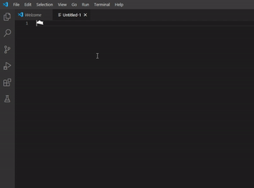

# Bongo Cat Decorator

This extension is based on the official [vscode-extension-samples/decorator-sample/](https://github.com/Microsoft/vscode-extension-samples/tree/master/decorator-sample).
It adds Bongo Cat animated icon to the end of the file. 

## VSCode API

The code uses VSCode's [`TextEditor.setDecorations`](https://code.visualstudio.com/api/references/vscode-api#TextEditor.setDecorations) and [`vscode.window.createTextEditorDecorationType`](https://code.visualstudio.com/api/references/vscode-api#window.createTextEditorDecorationType) APIs.

## Running the Sample

* `npm install` to initialize the project
* `npm run watch` to start the compiler in watch mode
* open this folder in VS Code and press `F5`
* this will open the `[Extension Development Host]` window, running the extension:
  * Open any document that contains single and multi-digit numbers.
  * The extension will decorate single and multiple-digit numbers as shown in the screenshot above.
